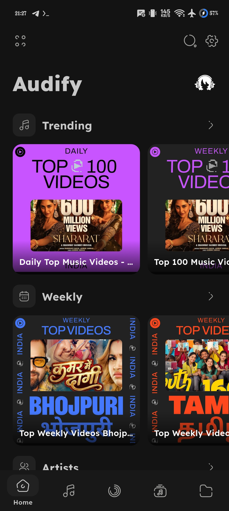
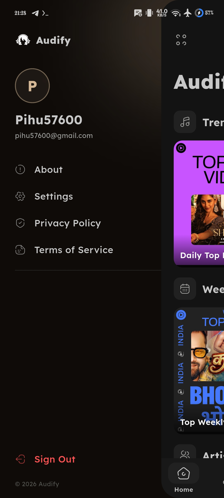
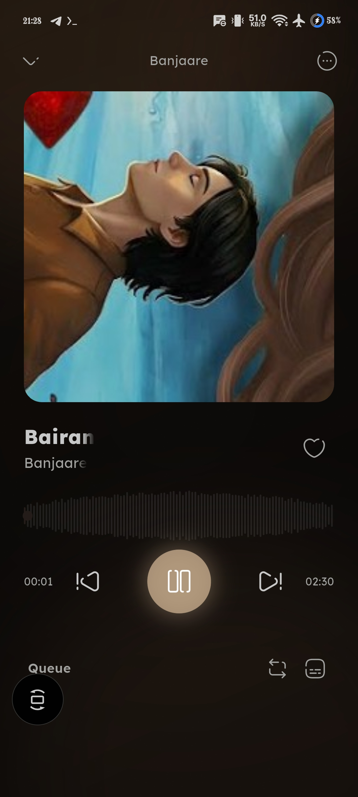

# Audify

### The Complete Flutter Music Experience

Modern Android music platform built with Flutter — focused on immersive visuals, smooth performance, synced lyrics, playlists, and a premium user experience without subscriptions.

 

---

# About Audify

Audify is a modern Flutter-based Android music experience crafted for users who want a clean, immersive, and feature-rich music platform without unnecessary restrictions or subscriptions.

The project combines:
- smooth animations
- immersive playback
- synced lyrics
- playlist management
- modern UI systems
- lightweight performance
- responsive interactions

Everything is designed to feel fluid, modern, and enjoyable while maintaining a minimal and polished experience.

---

# Experience Preview

  

---

# Feature Ecosystem

## Music Experience
- Dynamic playback interface
- Smooth music controls
- Responsive interaction system
- Immersive fullscreen player
- Elegant transition animations

## Lyrics System
- Real-time synced lyrics
- Smooth lyric scrolling
- Modern reading interface
- Dynamic lyric transitions

## Playlist Management
- Create playlists
- Organize favorite tracks
- Smart music collections
- Fast playlist access
- Seamless queue handling

## UI & Motion
- Premium dark interface
- Modern Android aesthetics
- Smooth Flutter animations
- Rounded modern components
- Carefully designed motion system

## Performance
- Lightweight architecture
- Optimized Flutter rendering
- Fast startup performance
- Smooth navigation experience
- Efficient UI management

---

# Why Audify?

Audify is built for users who want:
- premium music experience
- synced lyrics
- beautiful UI
- smooth performance
- playlist freedom
- modern Android feel
- everything in one place

without subscriptions, locked features, or bloated interfaces.

---

# Installation

## Android Setup

1. Open the **Releases** section
2. Download the latest APK
3. Install Audify
4. Launch and enjoy the experience

---

# Screenshots

| Splash | Home |
|------|------|
|  |  |

| Profile | PlayList |
|------|------|
|  |  |

| Premium Interface |
|------|
|  |

---

# Development Notice

> ⚠️ Audify is currently under active development.
>
> Some features, animations, or interactions may still feel experimental, unfinished, or slightly glitchy while the project continues evolving.
>
> The application is not considered fully production-ready yet — but the experience is already smooth, immersive, and genuinely enjoyable to use.

---

# Development Status

Audify is continuously improving with ongoing work focused on:
- advanced playback systems
- enhanced lyric experience
- smoother animations
- improved performance
- better interaction flow
- modern Android integrations
- immersive UI refinements

---

# Repository Purpose

This repository is maintained for:
- application releases
- issue tracking
- documentation
- update announcements
- screenshots & previews
- community feedback

Source code is not publicly distributed.

---

# Support

Found a bug or issue?

Please open an issue with:
- proper description
- reproduction steps
- screenshots if possible

Suggestions and feedback are always appreciated.

---

# Technology Stack

- Flutter
- Dart
- Android SDK
- Material Design
- Modern Motion UI Principles

---

# Disclaimer

Audify is developed for modern Android multimedia experience experimentation, music interaction design, and immersive interface development.

---

### Audify — Music, Lyrics, Playlists & Premium Experience. Completely Free.

